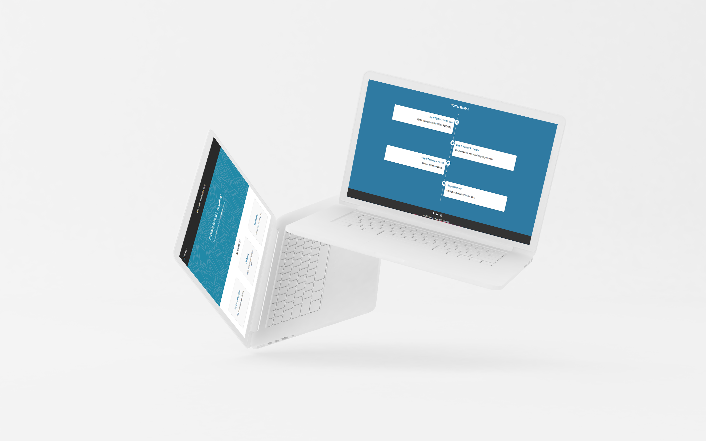
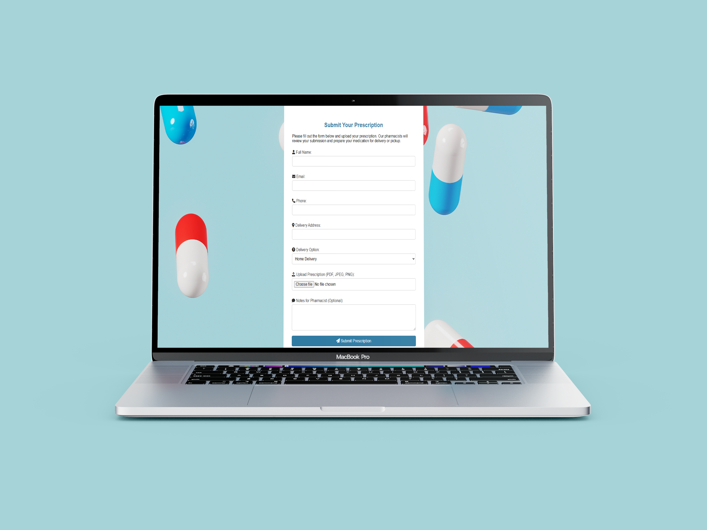

# Online Pharmacy Web Application

This Online Pharmacy Web Application allows users to submit prescriptions, track orders, and get medications delivered to their doorsteps. The platform provides a simple and user-friendly interface to manage prescriptions securely and efficiently. Pharmacists can review orders and ensure that medications are prepared accurately for delivery or pickup.


## Table of Contents

1. [Built With](#built-with)
2. [Features](#features)
3. [Installation](#installation)
4. [MockUps](#mockups)
5. [Usage](#usage)
7. [Database Structure](#database-structure)
8. [Technologies Used](#technologies-used)
9. [Contributing](#contributing)
10. [License](#license)
11. [Contact](#contact)

## Built With


## Features

- **Prescription Submission**: Users can upload prescription files (PDF, JPEG, PNG) for review.
- **Order Tracking**: Users are notified when their medications are in transit.
- **Secure Data Management**: All sensitive user data and prescription files are securely managed.
- **Delivery or Pickup Option**: Users can choose to have their medication delivered or pick it up at the pharmacy.
- **Pharmacist Review**: Pharmacists review and verify each prescription to ensure accuracy.
- **Mobile Responsive**: The website is optimized for mobile use.

## Installation

### Prerequisites

- [XAMPP](https://www.apachefriends.org/index.html) or any local server environment.
- PHP 7.x or later
- MySQL or MariaDB database
- Composer (optional for dependency management)

### Steps

1. **Clone the repository**:
    ```bash
    git clone https://github.com/ZanderBez/pharmacy
    ```

2. **Navigate to the project directory**:
    ```bash
    cd pharmacy
    ```

3. **Move the project to your XAMPP or other server environment’s `htdocs` folder**:
    ```bash
    mv pharmacy /path/to/xampp/htdocs/
    ```

4. **Set up the database**:
    - Import the database structure from `online_pharmacy.sql` using phpMyAdmin or the MySQL command line:
      ```bash
      mysql -u root -p online_pharmacy < /path/to/online_pharmacy.sql
      ```
    - Alternatively, create the tables manually using the provided SQL queries.

5. **Update Database Configuration**:
    - Modify the `db_connect.php` file with your database credentials:
    ```php
    $servername = "localhost";
    $username = "root";
    $password = "";
    $dbname = "online_pharmacy";
    ```

6. **Start the server**:
    - Open XAMPP and start Apache and MySQL services.

7. **Access the Application**:
    - Open your browser and navigate to `http://localhost/pharmacy/Pages/index.php`.

## MockUps

### Home Page


### Prescription Page


### Contact Us Page


### About Us Page


## Usage

- **Submit a Prescription**: Navigate to the Prescription page, fill out the form, and upload your prescription. You will receive a notification when your medication is ready for delivery or pickup.
- **Contact Us**: Reach out to our support team for inquiries related to your order or general questions.
- **Track Orders**: You will receive updates once your prescription has been reviewed and is in transit.

## Database Structure

- **Table Name**: `prescriptions`
    - `id` (INT, Auto Increment, Primary Key)
    - `name` (VARCHAR, 255)
    - `email` (VARCHAR, 255)
    - `phone` (VARCHAR, 50)
    - `address` (TEXT)
    - `delivery` (VARCHAR, 100)
    - `message` (TEXT)
    - `prescription_file` (LONGBLOB)
    - `file_type` (VARCHAR, 50)
    - `created_at` (TIMESTAMP, default: CURRENT_TIMESTAMP)

## Technologies Used

### Front-end:
- HTML
- CSS (Custom and Font Awesome)
- JavaScript

### Back-end:
- PHP
- MySQL/MariaDB

### Other:
- Apache (via XAMPP)
- phpMyAdmin (for database management)

## Contributing

If you'd like to contribute to this project, please fork the repository and use a feature branch. Pull requests are warmly welcome.

## License

This project is licensed under the MIT License - see the LICENSE file for details.

## Contact

- **Name**: Zander Bezuidenhout
- **Email**: bezuidenhoutzander8@gmail.com
- **GitHub**: [https://github.com/ZanderBez](https://github.com/ZanderBez)

